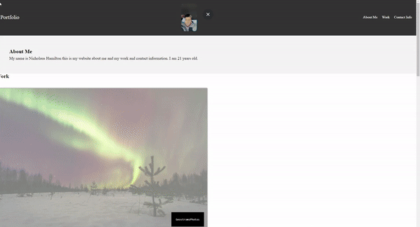

# challenge-week-2

## Description

I was tasked to build a porfolio from scratch using all the knowledge that i was taught in the last two weeks.
Doing that by making and html file along with an css style and reset file with code in side of each template ,
but this challege mostly focuses on my css skills to show how I can make my website boom.

This website contains information about me, my projects that i have done ,and the many ways you can contact me.

With this challenge I am aloud to work on my coding skills while make a portfolio for my future projects and jobs interveiws
### Assets
